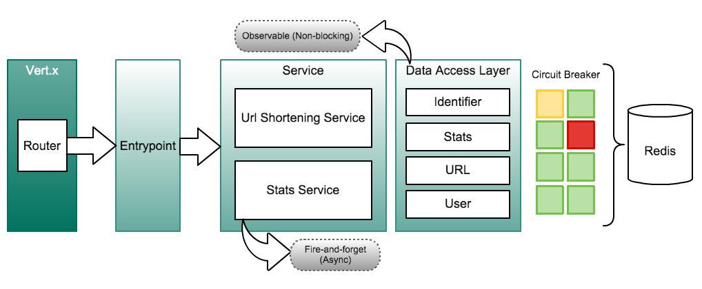

# Url Shortening Service

URL Shortening service

## Dependencies
- [sbt (v0.13.8)](https://dl.bintray.com/sbt/native-packages/sbt/0.13.9/sbt-0.13.9.tgz)
- Java 8 (build 1.8.0_25-b17) and [Redis (v=3.0.2)](http://download.redis.io/releases/redis-3.0.2.tar.gz)

## Steps to execute the service
```
1. cd url-shortener/
2. ./gradlew build
3. java -jar build/libs/url-shortener-1.0-SNAPSHOT.jar
```

### Steps to execute stress tests & open report
```
1. cd url-shortener-stress-test/
2. sbt test && sbt lastReport
```
## Solution design

